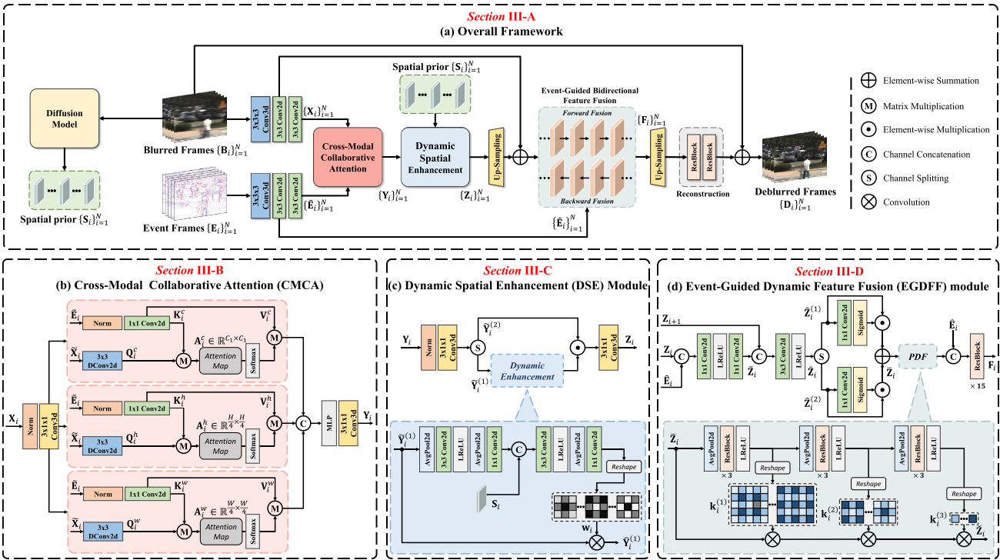
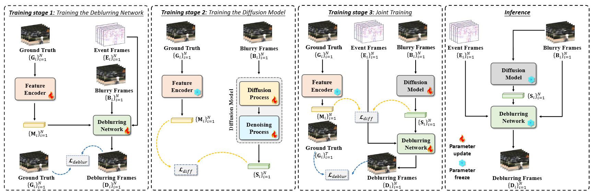
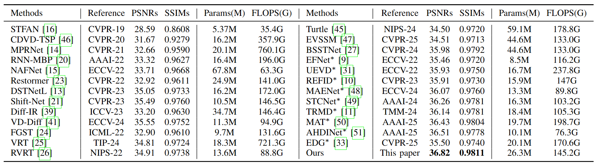
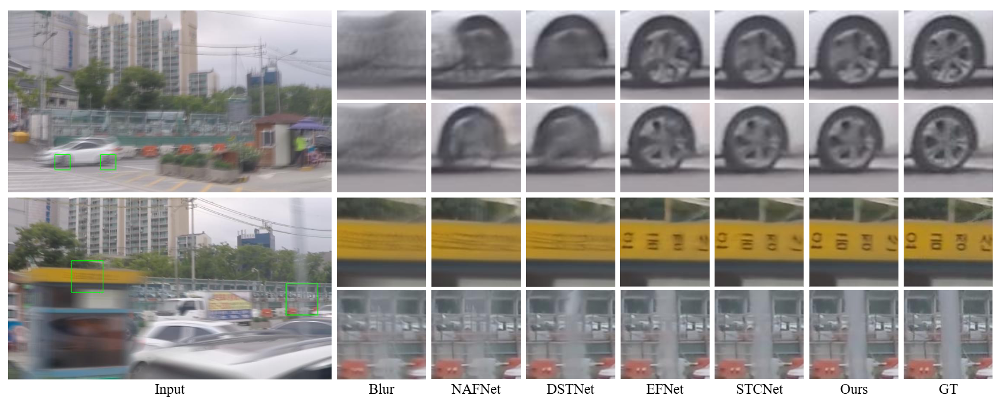
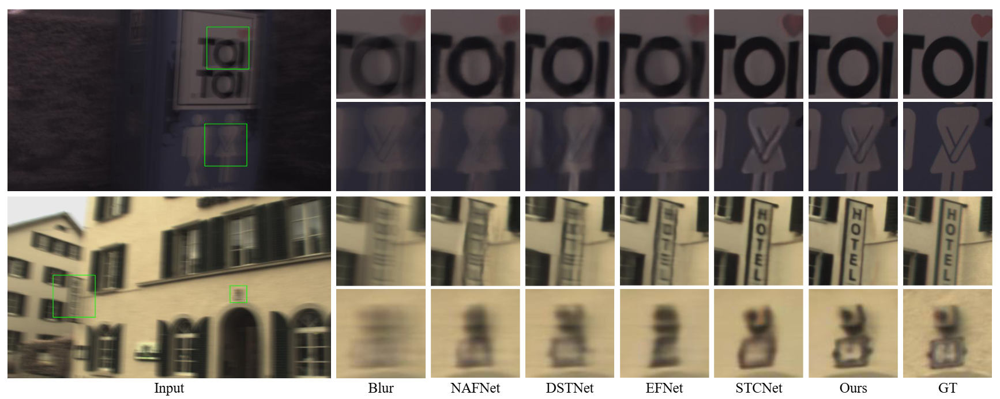
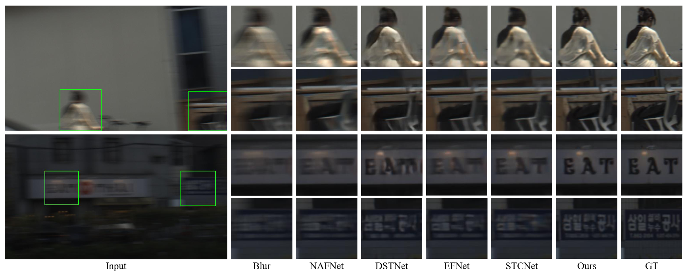

# Event-aware and Diffusion prior: Cross-modal Spatio-Temporal Fusion for Efficient Video Deblurring

## Abstract
Recovering high quality clear video from highly blurred video is a challenging task. In recent years, event-based solutions and flow-guided approaches have made significant progress in the field of video deblurring. However, the error introduced by optical flow estimation and the modal difference between event information and images limit the deblurring capability of these methods. For this reason, we propose a new approach for video deblurring. We use a diffusion model to generate a priori features with bootstrapping and combine them with event information for video deblurring. First, we propose an attention module and feedforward network that combines event information and a priori features for deblurring a single frame. Then, we introduce an event-guided dynamic feature fusion module to adaptively fuse features from neighboring frames. Furthermore, we restrict the diffusion process to a highly compact space to reduce the computational burden. Experiments on synthetic and real datasets demonstrate that our method outperforms state-of-the-art methods.

## Framework




## Qualitative evaluation
### GOPRO dataset


## Deblurring results
### GOPRO dataset


### HighREV dataset


### REVD dataset


# Get Started

## Dependencies
- Linux (Ubuntu 18.04)
- Python 3.9  
- Pytorch 2.0.1 `pip install torch==2.0.1 torchvision==0.15.2 torchaudio==2.0.2 --index-url https://download.pytorch.org/whl/cu118`
- CUDA 11.8
- install others packages `pip install -r requirements.txt`

## Dataset
Please prepare your datasets (GOPRO, DVD, HighREV) according to the following format:  
```
|--dataset_name
    |--blur
        |--video 1
            |--frame 1
            |--frame 2
                :
    |--gt
        |--video 1
            |--frame 1
            |--frame 2
                :
    |--events
        |--video 1
            |--frame 1
            |--frame 2
                :    
```

## Training

### Train Stage-1
If you only have one GPU, run the following command:  

`python basicsr/train.py -opt options/train/train_GOPRO_S1.yml`  

If you have multiple GPUs, run the following command:  

`python -m torch.distributed.run --nproc_per_node=4 --master_port=4321 basicsr/train.py -opt options/train/train_GOPRO_S1.yml --launcher pytorch`

### Train Stage-2
If you only have one GPU, run the following command:  

`python basicsr/train.py -opt options/train/train_GOPRO_S2.yml`  

If you have multiple GPUs, run the following command:  

`python -m torch.distributed.run --nproc_per_node=4 --master_port=4321 basicsr/train.py -opt options/train/train_GOPRO_S2.yml --launcher pytorch`

### Train Stage-3
If you only have one GPU, run the following command:  

`python basicsr/train.py -opt options/train/train_GOPRO_S3.yml`  

If you have multiple GPUs, run the following command:  

`python -m torch.distributed.run --nproc_per_node=4 --master_port=4321 basicsr/train.py -opt options/train/train_GOPRO_S3.yml --launcher pytorch`

## Testing
Run the following command (You can download pretrained weights):

```
python basicsr/test.py -opt options/test/test_GOPRO.yml
cd results
python merge_full.py
python calculate_psnr.py
```

